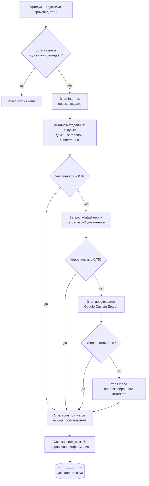

# AliasFinder Platform

**AliasFinder** — сервис для определения производителя товара по артикулу. Оператор загружает
список артикулов (вручную, Excel/CSV-файлом или через REST API), при желании указывает, какого
производителя или алиас он ожидает, а система находит реального производителя в интернете,
сверяет его с указанным и сохраняет результат вместе со справочной информацией о компании
(что производит, сайт, страна, другие названия).

Сервис рассчитан на закупщиков, снабженцев и контент-менеджеров, которые работают с
номенклатурой электронных компонентов, электротехники, промышленного и измерительного
оборудования: он заменяет ручной «гуглинг» каждого артикула и проверку, совпадает ли бренд из
заявки с фактическим изготовителем.

- **Бэкенд**: FastAPI + асинхронный SQLAlchemy (SQLite по умолчанию), httpx, OpenAI SDK.
- **Фронтенд**: Vite + React + TypeScript + Material UI.
- **Развёртывание**: Docker Compose или локальный запуск.

---

## Содержание

1. [Функционал](#функционал)
2. [Принцип работы](#принцип-работы)
3. [Архитектура](#архитектура)
4. [Развёртывание](#развёртывание)
5. [Переменные окружения](#переменные-окружения)
6. [Аутентификация и роли](#аутентификация-и-роли)
7. [REST API](#rest-api)
8. [Веб-интерфейс](#веб-интерфейс)
9. [Уведомления Telegram](#уведомления-telegram)
10. [Тестирование](#тестирование)
11. [Ограничения и рекомендации](#ограничения-и-рекомендации)

---

## Функционал

### Поиск производителя

- **Многоэтапный поиск** `Internet` → `googlesearch` → `OpenAI`: каждый следующий, более дорогой
  этап запускается только если предыдущие не дали уверенного ответа. Типичный артикул
  определяется за 1–3 секунды без обращения к OpenAI.
- **Несколько источников**: SerpAPI (Google), бесплатная выдача Yahoo / Bing / DuckDuckGo / Google,
  Google Custom Search API, анализ даташитов (PDF/HTML) и OpenAI.
- **Оценка уверенности** 0…1 для каждого результата и история этапов (`stage_history`): какой
  источник дал ответ, сколько ссылок рассмотрено, почему этап пропущен.
- **Сверка с подсказкой оператора**: статус «Совпадает» / «Расхождение» / «Ожидает проверки»
  с учётом алиасов (`TI` = Texas Instruments), транслитерации (`Сибеко` = Sibeco) и дочерних
  брендов (Linear Technology → Analog Devices).
- **Справочная информация** о производителе: что производит, официальный сайт, другие названия,
  страна.
- **Выбор этапов вручную**: кнопки «Google» и «OpenAI» перепроверяют выбранные строки только
  указанным источником, минуя кеш.
- **Кеш результатов**: уже определённые артикулы возвращаются из базы мгновенно, без внешних
  запросов и расхода токенов.

### Работа с данными

- **Три способа добавить артикулы**: ручной ввод в интерфейсе, REST API (`POST /api/parts`),
  загрузка Excel (`.xlsx`, `.xls`) или CSV.
- **Одна строка на артикул**: повторное добавление того же артикула обновляет подсказку, а не
  создаёт дубликат; повторяющиеся строки в файле объединяются.
- **Экспорт** всей таблицы в Excel и PDF (кириллица, переносы длинных значений); экспортированный
  Excel можно загрузить обратно.
- **Журнал запросов**: каждое обращение к поисковикам и OpenAI (запрос, статус, ответ) сохраняется
  и доступно на странице «Логи» с фильтрами и автообновлением.

### Интерфейс и администрирование

- Единая таблица товаров с выбором строк, фильтром «Все / Найденные / Не найденные», раскрываемыми
  деталями (история этапов, источник, отладочный лог), настройкой размера, шрифта и положения.
- Реальный прогресс пакетного поиска («Обработано M из N», найдено, ошибки, статусы этапов).
- Режим отладки: подробный разбор, какие признаки и кандидаты рассматривались.
- Роли оператор/администратор; администратор меняет учётные данные операторов и настраивает
  уведомления Telegram.
- Светлая и тёмная темы, адаптивная вёрстка.

---

## Принцип работы

### Общая схема



### 1. Кеш

Если артикул уже определён, а подсказка оператора совпадает с найденным производителем (или не
указана), результат возвращается из базы без внешних запросов. Если в запросе явно выбраны этапы
(`stages`), кеш игнорируется.

### 2. Этап Internet — поиск в выдаче

1. Формируются запросы `<артикул> <подсказка>` и `<артикул>`; они выполняются **параллельно** у
   первого доступного провайдера: SerpAPI (если задан ключ) → Yahoo → Bing → DuckDuckGo → Google.
2. **Защита от мусорной выдачи.** Бесплатные поисковики при подозрении на бота показывают капчу
   или подсовывают нерелевантную выдачу. Выдача, в которой нет ни одного упоминания артикула,
   отбрасывается, и запрос уходит следующему провайдеру; провайдер, повторно вернувший мусор или
   капчу, временно отключается, чтобы не тратить время.
3. **Анализ метаданных** (без скачивания страниц). Из каждого результата извлекаются признаки
   производителя:
   - официальный сайт производителя, на котором упомянут артикул (`ti.com/product/NE555`);
   - сегменты URL дистрибьюторов (`digikey.com/.../detail/stmicroelectronics/LM317T/`);
   - заголовки карточек (`LM317T STMicroelectronics | Mouser`, `… Datasheet (PDF) - Texas Instruments`);
   - поля `Manufacturer:` / `Производитель:` / `Brand:` в описаниях;
   - упоминания известных производителей рядом с артикулом.
4. Если уверенность ниже 0.8, параллельно выполняется запрос `<артикул> datasheet` и скачиваются
   3–4 самых информативных документа (даташиты, страницы производителя). Документы читаются
   потоково с ограничением размера, из PDF — только первые и последняя страницы. В тексте ищутся
   копирайт (`© 2016 Texas Instruments`), поля производителя и упоминания рядом с артикулом.
5. Этап успешен при уверенности ≥ 0.75.

### 3. Этап googlesearch — Google Custom Search

Выполняется, только если уверенность после этапа Internet ниже 0.75 и настроены ключи
Google CSE. Найденные признаки добавляются к уже собранным. Порог успеха — 0.67.

### 4. Этап OpenAI — анализ контекста

Выполняется, только если уверенность ниже 0.8 (или этап выбран явно). Модель получает не сырые
страницы, а компактный контекст: около 8 самых релевантных результатов выдачи, выдержки из
документов вокруг артикула и эвристических кандидатов (~1000 токенов). Ответ — JSON с названием
производителя, уверенностью и ссылкой-источником. Ответ, подтверждённый выдачей, получает высокий
вес; не подтверждённый — пониженный. Если этап запущен отдельно (кнопка «OpenAI»), перед запросом
собирается минимальный контекст одним заходом веб-поиска.

### 5. Агрегация признаков и уверенность

- У каждого признака есть вес: официальный сайт — 0.9, URL дистрибьютора — 0.6, заголовок карточки
  — 0.55, упоминание в описании — 0.35 и т. д. Вес умножается на точность совпадения артикула:
  точное — 1.0, с суффиксом исполнения (`LM317T` → `LM317TG`) — 0.75, базовая серия (`LM317`) — 0.5.
- Признаки с одного сайта не суммируются, а голоса разных сайтов объединяются как независимые
  подтверждения: `S = 1 − Π(1 − w)`. Несколько независимых источников дают высокую уверенность,
  единичное упоминание — низкую.
- Если у второго кандидата сопоставимая поддержка, уверенность лидера снижается — так честно
  отражаются детали, которые выпускают несколько компаний (LM317T делают ST, TI и onsemi).
- Подсказка оператора становится решающей, если выдача её заметно подтверждает.
- При итоговой уверенности ниже 0.45 производитель не считается найденным: сервис вернёт
  «не найден / ожидает проверки», а не случайное название.

### 6. Сравнение артикулов и названий

- Артикулы сравниваются без учёта регистра, пробелов, дефисов и точек; кириллические буквы,
  похожие на латинские (артикул, набранный в русской раскладке), приравниваются к латинским, а
  российские артикулы (`К155ЛА3`) поддерживаются как есть. Артикул не засчитывается внутри
  чужого номера (`5935-0560-0001` ≠ `0560-0001`).
- Названия производителей приводятся к каноническому виду по встроенному справочнику
  (~180 компаний: домены, алиасы на английском, русском, китайском, японском и корейском, дочерние
  бренды), с учётом юридических форм (`Inc.`, `GmbH`, `ООО`), лишних слов (`Murata Electronics`,
  `NXP USA Inc`), транслитерации и опечаток. Поиск упоминаний учитывает границы слов, поэтому
  «intelligent» не считается упоминанием Intel.

### 7. Сохранение и справочная информация

Результат (производитель, уверенность, источник, этап, история этапов, статус сверки) сохраняется
отдельной транзакцией для каждого артикула, поэтому прерванный пакет не теряет уже найденное.
Справочная информация о производителе берётся из встроенного справочника или из ранее найденных
записей; OpenAI запрашивается только для неизвестных производителей, а ответ кешируется.

### Производительность

- До `SEARCH_CONCURRENCY` артикулов (по умолчанию 4) обрабатываются параллельно; одинаковые позиции
  в пакете ищутся один раз.
- Сетевые запросы внутри одного артикула тоже идут параллельно; общий HTTP-клиент переиспользует
  соединения, удачные ответы поисковиков кешируются на час.
- Разбор PDF и Excel вынесен в отдельные потоки и не блокирует сервер.
- Интерфейс отправляет выбранные строки пачками по 5: таблица заполняется постепенно, а ошибка
  одной пачки не прерывает весь поиск.

Подробности алгоритма — в [OPTIMIZED_SEARCH_LOGIC.md](OPTIMIZED_SEARCH_LOGIC.md).

---

## Архитектура

```
Alias/
├── backend/
│   ├── app/
│   │   ├── api/            # REST-маршруты (router.py) и зависимости авторизации (deps.py)
│   │   ├── core/           # настройки, БД (SQLite WAL), JWT, общие HTTP/OpenAI-клиенты
│   │   ├── models/         # SQLAlchemy: parts, manufacturers, manufacturer_aliases, users, settings, search_logs
│   │   ├── schemas/        # Pydantic-схемы запросов и ответов
│   │   └── services/
│   │       ├── optimized_search_engine.py  # поисковый движок и этапы
│   │       ├── search_providers.py         # SerpAPI, Google CSE, Yahoo, Bing, DuckDuckGo, Google
│   │       ├── evidence.py                 # извлечение и агрегация признаков производителя
│   │       ├── manufacturers.py            # справочник производителей, сравнение названий и артикулов
│   │       ├── manufacturer_service.py     # запись производителей в БД, справочная информация
│   │       ├── document_parser.py          # загрузка и разбор PDF/HTML
│   │       ├── ai.py                       # запросы к OpenAI с ответом в JSON
│   │       ├── importer.py / exporter.py   # импорт Excel/CSV, экспорт Excel/PDF
│   │       ├── telegram_notifier.py        # уведомления Telegram
│   │       └── log_recorder.py             # журнал запросов к внешним сервисам
│   └── tests/              # pytest
├── frontend/               # Vite + React + Material UI
├── docker-compose.yml
├── OPTIMIZED_SEARCH_LOGIC.md
└── README.md
```

При старте бэкенд создаёт схему БД и добавляет недостающие колонки в существующую базу, поэтому
после обновления образов повторная инициализация не требуется.

---

## Развёртывание

### Вариант A. Docker Compose

```bash
# один раз скопируйте и отредактируйте настройки
cp backend/.env.example backend/.env

# соберите образы и запустите сервисы
docker compose up --build
```

После старта:

- API (FastAPI, Swagger на `/docs`) — http://localhost:8000
- веб-интерфейс — http://localhost:5173

Фронтенд обращается к API по адресу из `VITE_API_BASE_URL`; в Docker это `/api`, и Vite
проксирует запросы к сервису backend. Если переменная указывает на `localhost`, а интерфейс открыт
по другому адресу, клиент автоматически переключится на `http://<адрес_UI>/api`.

Данные (SQLite, файлы экспорта) хранятся в volume `backend_data` и не пропадают между
перезапусками. Для обновления кода пересоберите образы: `docker compose build`.

> Образ бэкенда основан на `python:3.11`, включает `httpx[socks]` (все внешние запросы могут идти
> через SOCKS5-прокси из `.env`) и шрифт DejaVu для кириллицы в PDF.

### Вариант B. Локальный запуск

```bash
# Backend
cd backend
python -m venv .venv
source .venv/bin/activate
pip install -r requirements.txt
cp .env.example .env          # отредактируйте, см. «Переменные окружения»
uvicorn app.main:app --reload

# Frontend (в другом терминале)
cd frontend
npm install
npm run dev
```

Интерфейс — http://localhost:5173, API — http://localhost:8000.

---

## Переменные окружения

`backend/.env` — основной файл конфигурации:

| Имя | Описание |
| --- | --- |
| `APP_NAME` | Название приложения в Swagger |
| `DEBUG` | `true` включает подробные логи и вывод SQL |
| `DATABASE_URL` | Строка подключения SQLAlchemy (по умолчанию SQLite) |
| `SERPAPI_KEY` | Ключ SerpAPI — самый стабильный источник выдачи Google (рекомендуется) |
| `SERPAPI_SEARCH_ENGINE` | Движок SerpAPI (по умолчанию `google`) |
| `GOOGLE_CSE_API_KEY` / `GOOGLE_CSE_CX` | Ключ и идентификатор Google Custom Search (этап `googlesearch`) |
| `OPENAI_API_KEY` | Ключ OpenAI (этап `OpenAI` и справка о неизвестных производителях) |
| `OPENAI_MODEL_DEFAULT` | Модель OpenAI (по умолчанию `gpt-4.1`; поддерживаются и модели, требующие `max_completion_tokens`) |
| `OPENAI_BALANCE_THRESHOLD_USD` | Устаревшая настройка: OpenAI не отдаёт баланс по обычному ключу; об исчерпании квоты сообщает Telegram |
| `WEB_SEARCH_PROVIDERS` | Бесплатные поисковики в порядке приоритета (по умолчанию `yahoo,bing,duckduckgo,google`) |
| `SEARCH_CONCURRENCY` | Сколько артикулов из одного запроса ищутся параллельно (по умолчанию 4) |
| `PROXY_HOST` / `PROXY_PORT` | SOCKS5-прокси для всех исходящих запросов |
| `PROXY_USERNAME` / `PROXY_PASSWORD` | Учётные данные прокси (если требуются) |
| `ALLOW_INSECURE_SSL` | `true` отключает проверку сертификатов (только для доверенных сетей) |
| `ALLOWED_ORIGINS` | Разрешённые Origin для CORS (через запятую или JSON-массив) |
| `STORAGE_DIR` | Каталог файлов экспорта (по умолчанию `storage/`) |
| `AUTH_SECRET_KEY` | Секрет подписи JWT — **обязательно смените** |
| `AUTH_ACCESS_TOKEN_EXPIRE_MINUTES` | Срок жизни токена (по умолчанию 90 минут) |
| `DEFAULT_USER_USERNAME` / `DEFAULT_USER_PASSWORD` | Учётные данные оператора, создаваемого при первом запуске |
| `ADMIN_USERNAME` / `ADMIN_PASSWORD` | Учётные данные администратора |

Пустые значения (например, `PROXY_PORT=`) считаются «не задано».

Фронтенд читает переменные с префиксом `VITE_`; главная — `VITE_API_BASE_URL` (для встроенного
прокси dev-сервера достаточно `/api`).

### Где взять ключи

1. **SerpAPI** — https://serpapi.com → ключ в `SERPAPI_KEY`.
2. **Google Custom Search** — ключ API (https://developers.google.com/custom-search/v1/overview) и
   идентификатор поисковой системы `cx` → `GOOGLE_CSE_API_KEY`, `GOOGLE_CSE_CX`.
3. **OpenAI** — https://platform.openai.com → `OPENAI_API_KEY`, при необходимости `OPENAI_MODEL_DEFAULT`.
4. **SOCKS5-прокси** — `PROXY_HOST`, `PROXY_PORT` и при необходимости `PROXY_USERNAME`/`PROXY_PASSWORD`;
   используется всеми HTTP-клиентами (поисковики, загрузка документов, OpenAI, Telegram).

Без ключей сервис работает на бесплатной выдаче (этап Internet) — см.
[Ограничения](#ограничения-и-рекомендации).

---

## Аутентификация и роли

| Роль | По умолчанию | Возможности |
| --- | --- | --- |
| Оператор | `admin / admin` (`DEFAULT_USER_*`) | поиск, импорт, экспорт, логи |
| Администратор | `admin / Admin2025` (`ADMIN_*`) | всё то же + смена учётных данных операторов, настройки Telegram |

- Пароли задаются только в `.env`, встроенных «запасных» паролей нет. **В продакшене обязательно
  смените `AUTH_SECRET_KEY`, `ADMIN_PASSWORD` и `DEFAULT_USER_PASSWORD`** — при старте с
  настройками по умолчанию в лог выводится предупреждение.
- Оператор создаётся при первом запуске (когда таблица пользователей пуста). Логин и пароль,
  изменённые администратором в интерфейсе, действуют сразу и сохраняются после перезапуска.
- Все маршруты `/api/*`, кроме входа, требуют заголовок `Authorization: Bearer <token>`;
  проверить токен можно через `GET /api/auth/me`.

```http
POST /api/auth/login
Content-Type: application/json

{ "username": "admin", "password": "admin" }
```

```json
{ "access_token": "<JWT>", "token_type": "bearer", "username": "admin", "role": "user" }
```

---

## REST API

Интерактивная документация — `http://localhost:8000/docs`. Основные маршруты (все с заголовком
`Authorization: Bearer <token>`):

| Метод и путь | Назначение |
| --- | --- |
| `POST /api/auth/login` | Вход, получение токена |
| `GET /api/auth/me` | Текущий пользователь |
| `POST /api/auth/credentials` | Смена логина/пароля оператора (администратор) |
| `GET /api/parts` | Все товары с результатами поиска и историей этапов |
| `POST /api/parts` | Добавить товар без поиска (или обновить подсказку существующего) |
| `DELETE /api/parts/{id}` | Удалить товар |
| `POST /api/search` | Поиск производителей для списка артикулов |
| `POST /api/upload` | Загрузка Excel/CSV |
| `GET /api/export/excel`, `GET /api/export/pdf` | Сформировать файл экспорта |
| `GET /api/download/{filename}` | Скачать файл экспорта (заголовок или `?token=`) |
| `GET /api/logs` | Журнал запросов (`provider`, `direction`, `q`, `limit` ≤ 1000) |
| `GET/PUT /api/settings`, `POST /api/settings/test-telegram` | Настройки уведомлений (администратор) |

### Поиск

```http
POST /api/search
Content-Type: application/json

{
  "debug": true,
  "items": [
    { "part_number": "TPS7A4700", "manufacturer_hint": "TI" },
    { "part_number": "AD620", "manufacturer_hint": "Analog" }
  ],
  "stages": null
}
```

- `stages` не указан — выполняются нужные этапы, ранее найденные результаты берутся из базы;
- `stages: ["OpenAI"]` (или `["googlesearch"]`, `["Internet"]`, их комбинация) — только выбранные
  этапы, без кеша;
- `debug: true` — в `debug_log` попадают запросы, провайдеры и кандидаты с признаками.

Фрагмент ответа:

```json
{
  "part_number": "TPS7A4700",
  "manufacturer_name": "Texas Instruments",
  "submitted_manufacturer": "TI",
  "match_status": "matched",
  "match_confidence": 1.0,
  "confidence": 0.99,
  "source_url": "https://www.ti.com/product/TPS7A47",
  "search_stage": "Internet",
  "stage_history": [
    { "name": "Internet", "status": "success", "provider": "yahoo", "confidence": 0.99, "urls_considered": 7,
      "message": "Результатов поиска: 7. Лидер: Texas Instruments (0.99)" },
    { "name": "googlesearch", "status": "skipped", "message": "Не требуется: результат найден на этапе Internet" },
    { "name": "OpenAI", "status": "skipped", "message": "Не требуется: результат найден на этапе Internet" }
  ],
  "what_produces": "Аналоговые и встраиваемые микросхемы",
  "website": "https://www.ti.com",
  "country": "США"
}
```

Статусы этапа: `success`, `low-confidence`, `no-results`, `skipped`. Результат из кеша имеет
`search_stage = "cache"`.

### Импорт файла

```http
POST /api/upload
Content-Type: multipart/form-data

file=@parts.xlsx
```

- Колонка артикула: `Article`, `Part Number`, `PN`, `MPN`, `Артикул` и т. п.
- Колонка подсказки: `Manufacturer/Alias`, `Manufacturer`, `Req.Mnfc`, `Brand`, `Производитель` и т. п.
- Форматы: `.xlsx`, `.xls`, `.csv`; числовые артикулы сохраняются без `.0`, дубликаты объединяются.
- Некорректный файл возвращает `400` с описанием ошибки.

### Экспорт

`GET /api/export/excel` или `GET /api/export/pdf` возвращают `{"url": "/api/download/export.xlsx"}`.
Файл содержит колонки `Article`, `Manufacturer`, `Alias`, `Req.Mnfc`, `Match`, `What Produces`,
`Website`, `Manufacturer Aliases`, `Country`. Каталог файлов напрямую не публикуется — скачивание
только с авторизацией.

---

## Веб-интерфейс

- **Вход** — страница авторизации; неверный пароль показывается как ошибка входа.
- **Рабочая область**:
  - форма «Добавить товар» (артикул + производитель/алиас), кнопки «Загрузить Excel»,
    «Экспорт Excel», «Экспорт PDF»;
  - таблица товаров: `Article`, `Req.Mnfc`, `Manufacturer`, `Alias`, `Match`, `Confidence`,
    `Source`, «Что производит», «Сайт производителя», «Алиасы», «Страна»; строки раскрываются и
    показывают историю этапов и отладочный лог (с кнопкой копирования);
  - выбор строк и действия над выбранными: «Google», «OpenAI», «Общий поиск», удаление;
  - фильтр «Все / Найденные / Не найденные», размер таблицы и шрифта, перетаскивание,
    закрепление, полноэкранный режим;
  - карточка прогресса: «Обработано M из N», найдено, ошибки, статусы этапов.
- **Логи** — журнал запросов к поисковикам и OpenAI с фильтрами по запросу, провайдеру и типу,
  автообновлением и просмотром ответа.
- **Настройки** (администратор) — смена логина/пароля оператора, параметры Telegram.
- Режим отладки (иконка «жучка»), светлая/тёмная тема, выход из системы.

---

## Уведомления Telegram

Администратор на странице «Настройки» указывает токен бота и chat ID, включает уведомления и
проверяет их кнопкой «Отправить тест». Сервис в фоне (не чаще раза в час для каждого типа)
сообщает:

- об ошибке авторизации OpenAI;
- об исчерпании квоты/баланса OpenAI;
- о блокировке платных API (SerpAPI, Google CSE) из-за неверного ключа или превышения лимита.

---

## Тестирование

```bash
# Backend: справочник и сравнение названий/артикулов, парсеры выдачи, агрегация признаков,
# поисковый движок с фейковыми провайдерами, API. Внешние сервисы не вызываются.
cd backend
pip install -r requirements-dev.txt
pytest

# Frontend: проверка типов и сборка
cd frontend
npm run build
```

---

## Ограничения и рекомендации

- **Бесплатная выдача нестабильна при больших объёмах.** Yahoo, Bing, DuckDuckGo и Google
  ограничивают автоматические запросы с одного IP (капча, «мусорная» выдача). Сервис это
  распознаёт и не выдаёт ложных результатов, но часть артикулов останется «не найдена». Для
  регулярной работы с большими списками подключите **SerpAPI** и/или **Google Custom Search**, а
  для спорных случаев — **OpenAI**.
- Детали, которые выпускают несколько компаний (например, LM317T), без подсказки определяются с
  умеренной уверенностью — указывайте ожидаемого производителя в колонке `Manufacturer/Alias`.
- Для продакшена рекомендуется PostgreSQL вместо SQLite, запуск за reverse proxy и смена всех
  паролей и секретов по умолчанию.
- Ключи и пароли храните только в `backend/.env` (файл не коммитится).
